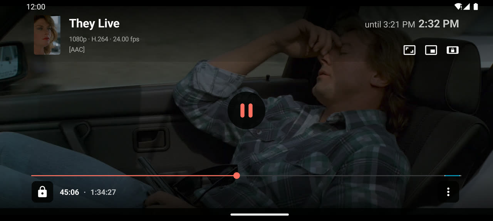
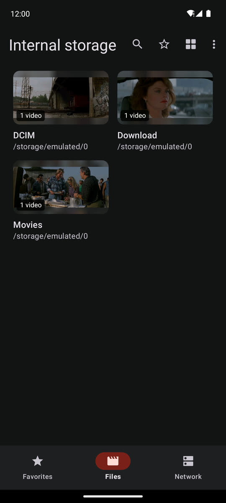
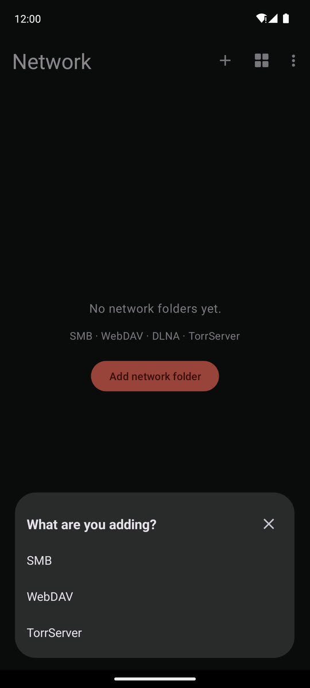
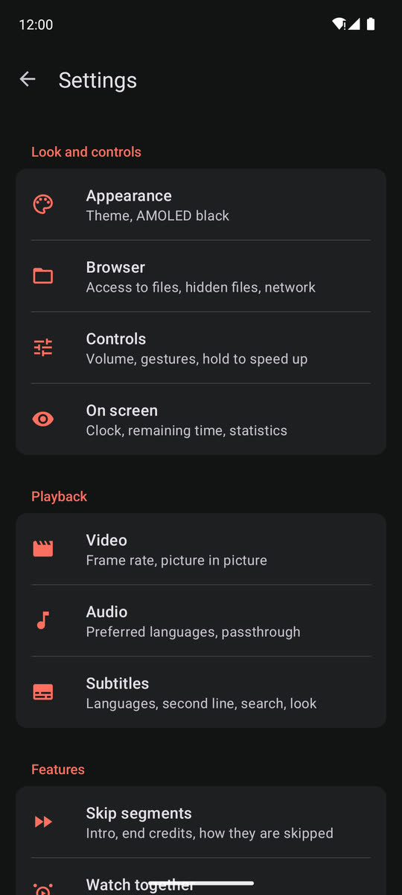
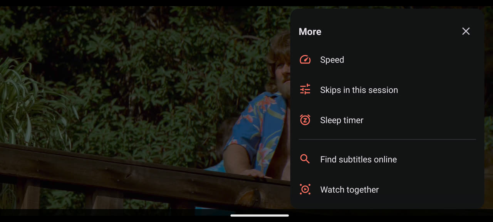
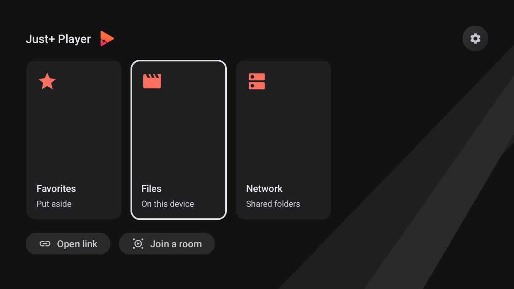

# Just+ Player

[](https://github.com/just-plus-player/just-plus-player/releases/latest)
[](https://github.com/just-plus-player/just-plus-player/releases)
[](https://github.com/androidx/media/releases/tag/1.11.0)

Video player and file browser for Android phones, tablets and Android TV, built on [Media3](https://github.com/androidx/media) (formerly [ExoPlayer](https://github.com/google/ExoPlayer)). Android 6.0 or later, one APK for all form factors.

It is a fork of [Just (Video) Player](https://github.com/moneytoo/Player) by Marcel Dopita and keeps what makes it good: no ads, no tracking, very few permissions, ExoPlayer's `ffmpeg` extension for AC3, E-AC-3, DTS, DTS-HD and TrueHD, and audio that stays in sync over Bluetooth. On top of that it opens on a file browser with network folders, has a reworked player interface, and adds the features below.



## Install

[](https://github.com/just-plus-player/just-plus-player/releases/latest) [](https://www.aftvnews.com/downloader/)

**Phone, tablet, TV box** — download the APK and open it. **Android TV / Fire TV** — no keyboard needed: install [Downloader](https://www.aftvnews.com/downloader/) and enter the code above.

Sideloaded builds check for updates themselves, show what changed and install the new version through the system installer, without going through a store.

## What Just+ adds

**Files and network folders**

 * The app opens on a browser with three destinations: **Files**, **Network** and **Favorites**. On a TV it opens on a start page with a card for each, plus Open link and Join a room
 * Files lists the device's own storage as rows, as tiles with a still from each video, or in columns on a wide screen. Each file shows its resolution, size and date, and where you stopped watching
 * Search the folder that is open, or everything below it
 * **Network**: play and browse SMB shares, WebDAV servers, DLNA/UPnP media servers and TorrServer. Machines on the local network are found for you; an address can be typed in as well, and a share that wants a password asks for it
 * A media server shows its own posters; on a TorrServer you can add a magnet link and delete a torrent
 * Hold a folder or a file to put it in Favorites
 * The folder a file was opened from becomes its playlist
 * Optional access to all files (Android 11+) so every folder can be listed, and switches for hidden files and `.nomedia`

**Player and controls**

 * Poster, title and a metadata line (resolution · codec · fps · audio) in the header, next to the clock and the time playback will end
 * Tap anywhere on the time bar to seek there; letting go of a drag lands exactly where the finger was
 * Hold the picture to speed up: 2× and drag to change, always 2×, or off
 * Ten scaling modes — Fit, Crop, Fill, 16:9, 4:3, 16:10, 2:1, 2.35:1, 2.39:1, 5:4. A tap cycles the first five, a long press opens the full list
 * Volume up to 200 % with a loudness boost, and volume and brightness gestures that report a percentage
 * Lock the screen from the bottom bar, unlock with a swipe
 * Everything else sits behind ⋮ **More**: speed, sleep timer, skips in this session, online subtitles, watch together, open link, browse, settings
 * Speed from 0.25× to 4× in 0.05 steps, with presets
 * Sleep timer: 15–90 minutes, after the current file, or any time up to 12 hours on a keypad, with −/+ 5 minutes; the volume fades out over the last 30 seconds
 * Optional clock over the video, a transfer line (buffer, network, bitrate) above the seek bar, and a statistics overlay

**Picture**

 * Match the display's refresh rate — and, if you want, its resolution — to the video, for every episode of a playlist and not only the first
 * 10-bit AV1 plays, including Dolby Vision profile 10
 * Dolby Vision options: keep it away from the decoder, map profile 7 onto an ordinary HEVC decoder, drop HDR10+ when converting
 * A video track the device cannot decode is reported, instead of the sound playing over a black screen

**Sound**

 * Pass-through of Dolby and DTS to a receiver, and a forced mode for TV boxes that under-report what the receiver accepts
 * Audio delay, set separately for decoded sound and for pass-through
 * Even out loud and quiet (night mode), and dialogue louder than the rest
 * A list of preferred audio languages: the player takes the first one a file actually has, and a language can be promoted straight from the audio panel
 * Audio tracks no decoder on the device can play are listed with the reason instead of being hidden, and a track the system decoder fails on partway through is handed to the bundled one

**Subtitles**

 * Their own appearance settings with a live preview: size, colour, bold, background and outline. A long press on the subtitle button opens them
 * A second subtitle line in another language — always under the first, or only when you pause
 * Search online (OpenSubtitles and others), by hand from ⋮ More or automatically when your language is missing. Results are matched to your exact file by its hash where the index knows it
 * Machine translation into your language when no subtitles in it exist
 * Subtitles next to a video are picked up by name, locally and over HTTP

**Skip segments**

 * Skip intros, recaps, ad breaks and end credits — segments are drawn right on the time bar
 * Segments come from the launching app, or are looked up online in SkipDB, SkipMe.db, IntroHater, IntroDB, TheIntroDB and Aniskip; the sources vote, and a segment several of them agree on is used
 * Separately for the intro and the end credits: a Skip button for five seconds, a Skip button for the whole segment, or skip automatically. The button can show the time left as a ring
 * Every skip can be undone, an automatic skip can be cancelled, and a session offset corrects a database that is a few seconds off

**Tracks and quality**

 * Side panels for audio, subtitles, quality, speed, sleep timer and the playlist; a button stays hidden until the media has something to put in it
 * Manual video quality: optimal, highest, a specific resolution, or one of the sources the launching app supplied
 * The playlist as a list or as a rail of frames

**Watch together**

 * Watch the same film in step with someone else — play, pause and seek are shared. Create a room, find one, or join by code or invite link; a password is optional
 * The room protocol is [LAMPA](https://github.com/lampa-app/LAMPA)'s `lparty` plugin's, so a viewer in the web player and a viewer here can share a room
 * On a TV box the invite is shown as a QR code

**Android TV**

 * A start page and focus that every control shows the same way, sized for a remote
 * Left and Right accelerate while held, and each press lands on a keyframe, so seeking is quick and goes where the readout says
 * Down opens the controls on the time bar; Back asks for a second press before it leaves the player (or leaves at once, if you prefer)
 * Long press the resize button to zoom with Up and Down

**Look**

 * Material 3 throughout: dark, light or following the system, AMOLED black, 32 accent colours
 * The app language is picked in the app

**When something breaks**

 * A full-screen report in plain language instead of ExoPlayer codes, with Copy, Share and Upload; the uploaded log can be read off the screen as a QR code
 * Watchdogs for a load that never starts, a stall in the middle of a film and a frozen picture, and retries for network sources that drop a piece
 * Fallbacks for Dolby Vision profile 7 and for tunnelled playback that freezes the picture

**Launcher integration**

 * Intent extras for position, title, poster, subtitles, HTTP headers, a playlist of episodes with per-episode segments and resume positions, quality variants, and IMDb/TMDB ids — as used by [LAMPA](https://github.com/lampa-app/LAMPA)/Lampac. See [Integration](#integration)

## Screenshots

**Files** — folders with a still from what is inside. **Network** — SMB, WebDAV, DLNA and TorrServer, found on the network or typed in. **Settings** — grouped by what they are about.

  

**More** — everything that is not a button of its own. **Skip segments** — a segment on the time bar and one button to skip it.

 

**Android TV** — the start page.



## Supported formats

 * **Audio**: Vorbis, Opus, FLAC, ALAC, PCM/WAVE (μ-law, A-law), MP1, MP2, MP3, AMR (NB, WB), AAC (LC, ELD, HE; xHE on Android 9+), AC-3, E-AC-3, DTS, DTS-HD, TrueHD, IAMF, MPEG-H
 * **Video**: H.263, H.264 AVC (Baseline Profile; Main Profile on Android 6+), H.265 HEVC, MPEG-4 SP, VP8, VP9, AV1 (8- and 10-bit)
 * **Containers**: MP4, MOV, WebM, MKV, AVI, Ogg, MPEG-TS, MPEG-PS, FLV
 * **Streaming**: DASH, HLS, SmoothStreaming, RTSP
 * **Network folders**: SMB 2/3, WebDAV, DLNA/UPnP, TorrServer
 * **Subtitles**: SRT, SSA/ASS ([limited styling](https://github.com/google/ExoPlayer/issues/8435)), TTML, VTT, DVB

HDR (HDR10+ and Dolby Vision) playback on compatible hardware. AC-4 audio works on devices that ship such a system decoder (e.g. Samsung Galaxy A, S and Z series on Android 11 or later).

## Inherited from Just (Video) Player

 * Horizontal swipe and double tap to seek
 * Vertical swipe to change brightness (left) / volume (right) — can be switched off
 * Pinch to zoom (Android 7+)
 * Picture-in-picture on Android 8+ (resizable on Android 11+), optionally started when you leave the app
 * Resume where you left off, per file
 * App shortcut straight to your videos (Android 7.1+)
 * Third-party equalizer / audio processing support (e.g. [Wavelet](https://github.com/Pittvandewitt/Wavelet))
 * Media Session and Audio Focus support, pause when headphones are disconnected
 * No ads, no tracking, no excessive permissions

## Build

JDK 17 and the Gradle wrapper:

```bash
./gradlew assembleLatestUniversalDebug   # debug APK
./gradlew build                          # what CI runs
```

Two flavour dimensions: `targetSdk` (`latest` = targetSdk 36, `legacy` = targetSdk 29 for legacy storage access) × `distribution` (`universal` with the in-app updater, `amazon`, `accrescent`). `latestUniversal` is the one that gets released.

`app/libs/lib-*.aar` are **prebuilt binaries** — an ExoPlayer core plus the ffmpeg, AV1, IAMF and MPEG-H decoder extensions. They are what makes AC3/DTS/TrueHD work, and their version has to stay in step with `media3_version` in `app/build.gradle`. All but one are taken as upstream publishes them; the AV1 one carries a rebuilt native library for 10-bit AV1. See [`app/libs/README.md`](app/libs/README.md).

## Integration

### Launching the player from another app

An `ACTION_VIEW` intent addressed to `com.justplus.player`, with the video as the data URI:

```java
Intent intent = new Intent(Intent.ACTION_VIEW);
intent.setPackage("com.justplus.player");                 // or the explicit component
intent.setDataAndType(Uri.parse(url), "video/*");         // content:// also needs FLAG_GRANT_READ_URI_PERMISSION
intent.putExtra("title", "Machines");
startActivityForResult(intent, REQUEST_PLAY);             // startActivity if you do not want a result
```

Everything else is optional extras:

| Extra | Type | Meaning |
|---|---|---|
| `title` | String / CharSequence | Title in the header. HTML entities are unescaped |
| `thumbnail` | String | Poster shown next to the title |
| `position` | int, ms | Where to start |
| `return_result` | boolean | Report position and duration back on exit (see below) |
| `headers` | String[] | Flat `name, value, name, value…`, applied to every HTTP request |
| `subs` | Parcelable[] of Uri | External subtitle files |
| `subs.name` | String[] | Their labels, aligned by index with `subs` |
| `subs.enable` | Parcelable[] of Uri | Its first element is the track to pre-select |
| `segments` | String | Skip/ad segments as JSON — format below |
| `season`, `episode` | int | Episode this file belongs to |
| `imdb_id` | String | IMDb id, used to look segments up online |
| `id` | String or int | TMDB id, same purpose |
| `quality_levels` | String[] | Labels of the quality variants, e.g. `1080p` |
| `quality_urls` | String[] or Parcelable[] of Uri | Their URLs, aligned by index with `quality_levels` |

A queue is passed the same way, with everything aligned by index against `video_list`:

| Extra | Type | Meaning |
|---|---|---|
| `video_list` | Parcelable[] of Uri, or String[] | The queue. The entry equal to the intent's data URI becomes the starting item |
| `video_list.name` | String[] | Titles; `video_list.filename` is the fallback, then the last path segment |
| `video_list.thumbnail` | String[] | Posters for the playlist panel |
| `video_list.segments` | String[] | One segments JSON per item |
| `video_list.season`, `.episode`, `.imdb_id`, `.id` | String[] | Episode metadata per item |
| `video_list.subtitles` | Parcelable[] or ArrayList of Bundle | External subtitles per item. Each Bundle holds `uris` (Parcelable[] of Uri) and `names` (String[]), aligned with each other |
| `video_list.quality_levels.<i>` | String[] | Quality labels for item `<i>` (0-based index in `video_list`) |
| `video_list.quality_urls.<i>` | String[] | Matching URLs for item `<i>` |

`video_list` and every `video_list.*` string array, as well as `quality_levels` and `quality_urls`, are read leniently — `String[]`, `ArrayList<String>` and `CharSequence[]` all work, and `quality_urls` also takes a `Parcelable[]` of `Uri`. `subs`, `subs.name` and `headers` are not: they have to be exactly the types in the table above, or they are silently ignored.

**Segments JSON** — `start` and `end` are seconds, `duration_ms` is the duration those timings were measured against, so the player can rescale them to the real file. `skip` is intro/recap/credits, `ad` is advertising:

```json
{ "duration_ms": 2696000,
  "skip": [{ "start": 62, "end": 152 }],
  "ad":   [{ "start": 0,  "end": 12  }] }
```

**Session mode.** The presence of `position`, `return_result`, `subs`, `subs.enable`, `video_list` or `quality_levels` puts the player in API mode: it keeps positions for that session only and writes nothing to its own resume store, so a launcher stays the owner of the watch state. `title` alone does not — the title is used and the state is still persisted.

**Result** (only with `return_result`): `RESULT_OK` and an intent with action `com.mxtech.intent.result.VIEW` (MX Player's contract), whose data URI is the item that was playing — not necessarily the one that was launched. Extras: `end_by` is `playback_completion` or `user`, and on an early exit `position` and `duration` (both int, ms).

The player is `singleTask`: a further `ACTION_VIEW` sent to the running instance replaces the extras rather than being ignored, which is how a source or an episode is switched without a restart.

### Feeding it from a LAMPA plugin

A plugin does not build the intent — LAMPA does, from the JSON handed to `Lampa.Player.play()`. Use these keys and it maps onto the extras above by itself:

```js
Lampa.Player.play({
    url: 'https://host/s01e03-1080.mp4',        // required, and must be byte-identical to the playlist entry
    title: 'Machines',
    thumbnail: 'https://host/still.jpg',
    quality: { '1080p': 'https://host/s01e03-1080.mp4', '720p': 'https://host/s01e03-720.mp4' },
    subtitles: [{ url: 'https://host/en.srt', label: 'English', language: 'en' }],
    segments: { duration_ms: 2696000, skip: [{ start: 62, end: 152 }], ad: [] },
    season: 1, episode: 3,
    imdb_id: 'tt14688458',
    headers: { 'User-Agent': '…', Referer: '…' },
    playlist: [ /* the same objects, one per episode */ ]
})
```

| Plugin JSON | Becomes |
|---|---|
| `url` | The data URI, and the entry in `video_list` |
| `title` | `title`, `video_list.name` |
| `thumbnail` | `thumbnail`, `video_list.thumbnail` |
| `quality` (`{label: url}`) | `quality_levels` / `quality_urls`, or `video_list.quality_*.<i>` per episode |
| `subtitles` (`[{url, label, language}]`) | `subs` / `subs.name` for a single video, `video_list.subtitles` in a queue |
| `segments` | `segments` / `video_list.segments`, serialised verbatim |
| `season`, `episode` | `season`, `episode` and the per-item arrays |
| `imdb_id`, or `card.imdb_id` from the open card | `imdb_id` |
| the card's `id` | `id` (TMDB) |
| `headers` (`{name: value}`) | `headers`, flattened to pairs |

What actually decides whether it matches:

 * **`url` must be identical** to the `playlist` entry it stands for. LAMPA finds the starting index by exact string comparison, and the player then matches its data URI against `video_list` the same way. One extra token or a trailing slash and the queue opens on episode 1.
 * **`playlist` is only read when auto-next is on** in LAMPA; otherwise the payload itself is the only item. Put the episode's own metadata on the top-level object as well, not just inside `playlist`.
 * **Name quality variants by resolution.** Both sides sort them by the number in the label, so `1080p`/`720p` order correctly while `HD`/`SD` do not.
 * **`segments` is passed through untouched**, so it has to be the shape above — seconds, plus `duration_ms` for rescaling.
 * **`imdb_id` and the card's `id` are what the online lookup keys on.** Without them only the segments you supply yourself are used; there is no title search.
 * **Nothing is switched on for the viewer.** Subtitles arrive as selectable tracks and LAMPA sends no default, so one has to be picked from the subtitle panel. `language` is not forwarded either — put whatever should be shown into `label`.
 * `subtitles[]` entries need both `url` and `label`; an entry without a label takes the whole list down with it.
 * **The subtitle format is taken from the URL path**, falling back to SubRip. A WebVTT or ASS file served from an extension-less endpoint therefore arrives labelled as SRT and will not parse — keep the real extension in the URL.


## FAQ

### Where are the settings?

In the browser, **⋮ → Settings**; on a TV, the gear on the start page. In the player, **⋮ More → Settings**, or long press ⋮ to go there directly. The App info screen works too.

### Where are my videos?

**Files** lists the folders that hold videos. Without further permission the browser sees what the system media index knows; granting **Access to all files** in Settings → Browser (Android 11+) lets it list every folder. Hidden files and folders with a `.nomedia` file can be shown there as well.

### How do I get to videos on network storage?

**Network → Add network folder.** SMB shares, DLNA media servers and TorrServer on the local network are found by themselves; anything else — including WebDAV — can be added by address. SFTP is not built in: open the video from a file manager that speaks it.

### How do I get subtitles?

 * A subtitle file next to the video with the same name (`video.mkv` → `video.srt`) is picked up automatically, locally and over HTTP
 * **⋮ More → Find subtitles online** searches OpenSubtitles and others; in Settings → Subtitles the search can run by itself when your language is missing, and translate when nothing in it exists
 * A subtitle file opened from a file manager is applied to the last video. 📺 On Android TV this is the way to bring your own file: open the video, go back, then open the subtitle file

### How do I change subtitle font, size or color?

**Settings → Subtitles → Appearance**, with a live preview. Long pressing the subtitle button in the player takes you straight there.

### How do I open a streaming link?

**Open link** — in the browser's ⋮ menu, on the TV start page and in the player's ⋮ More. A link on the clipboard is filled in for you. The player is also registered for compatible links, so tapping one in another app should offer it, and sharing a selected URL works as well.

### Are there any media formats it CANNOT play?

ExoPlayer does not handle some older formats such as WMV or [Theora](https://github.com/google/ExoPlayer/issues/4970), Android has no ProRes decoder, and most devices cannot decode [10-bit AVC](https://github.com/moneytoo/Player/issues/87#issuecomment-816228143). Audio-only playback is not a goal — this is a video player.

### How do I get rid of the black bars?

Pinch to zoom, or tap the resize button to cycle Fit → Crop → Fill → 16:9 → 4:3. A long press opens the full list of scaling modes. **Android TV**: long press resize to enter zoom mode, then zoom precisely with Up and Down.

### Bluetooth audio is out of sync

Pause and resume once. If a device is consistently off, Settings → Audio → Audio delay moves the sound against the picture.

### Why does it ask for "Modify system settings"?

The system folder picker, used when the app asks for access to a folder, always follows the current system orientation, even when the player sets its own. Granting `WRITE_SETTINGS` from the App info screen or via adb (`adb shell pm grant com.justplus.player android.permission.WRITE_SETTINGS`) lets the app temporarily enable Auto-rotate around it to partially work around [this imperfection](https://issuetracker.google.com/issues/141968218). Nothing else uses the permission, and the app works without it.

### The orientation button does nothing

Since Android 16 apps cannot [switch orientation](https://android-developers.googleblog.com/2025/01/orientation-and-resizability-changes-in-android-16.html) programmatically, but it can be re-enabled per app: open "Aspect ratio" in system Settings, find Just+ Player and switch it from "Full screen" to "App default".

## Credits and licence

Built on [Just (Video) Player](https://github.com/moneytoo/Player) by Marcel Dopita and on [AndroidX Media3](https://github.com/androidx/media). Translations come from upstream's [Weblate project](https://hosted.weblate.org/engage/just-player/). Released into the public domain under [the Unlicense](LICENSE), like upstream.

Other open source Android video players worth knowing: [VLC](https://code.videolan.org/videolan/vlc-android), [mpv](https://github.com/mpv-android/mpv-android), [Next Player](https://github.com/anilbeesetti/nextplayer), [Fermata](https://github.com/AndreyPavlenko/Fermata), [Nova Video Player](https://github.com/nova-video-player/aos-AVP), [Kodi](https://github.com/xbmc/xbmc) — or a [longer list on IzzyOnDroid](https://android.izzysoft.de/applists/category/named/multimedia_video_player).
